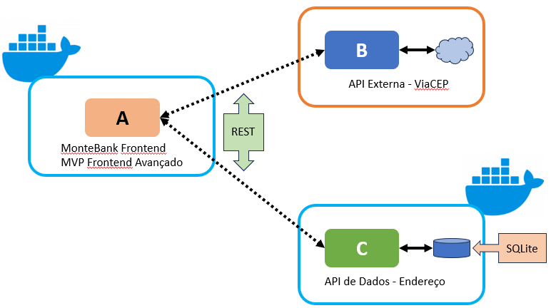

# MONTEbank Web App

O objetivo deste projeto é auxiliar no gerenciamento de várias contas bancárias e foi desenvolvido em React.

<!-- TABLE OF CONTENTS -->

## Conteúdo

- [MONTEbank Web App](#montebank-web-app)
  - [Conteúdo](#conteúdo)
  - [Sobre o projeto](#sobre-o-projeto)
    - [Arquitetura](#arquitetura)
    - [🛠️Tecnologias](#️tecnologias)
  - [Instalação](#instalação)
  - [Docker](#docker)
  - [Desenvolvedor](#desenvolvedor)

<!-- ABOUT THE PROJECT -->

## Sobre o projeto

MONTEbank é uma aplicação frontend desenvolvida usando React para servir como MVP para uma proposta de produto que permita o gerenciamento de várias contas bancárias. Foi o MVP da Sprint de Frontend Avançado da PUC-RJ e foram adicionadas funcionalidades de CRUD do endereço de um usuário, tornando-se parte do MVP da sprint de Backend Avançado, junto com a API REST que salva os dados de endereço em um BD SQLite. A API está disponível no [repositório](https://github.com/marcelo-monte/puc-rj-mvp-sprint3-backend-avancado-api). As funcionalidades de consulta de extrato e contas funcionam sem um backend, fazendo uso de um arquivo JSON para carregar as informações necessárias, simulando uma requisição a um backend (foi implementado assim na sprint de Frontend Avançado).

### Arquitetura

- Frontend - Montebank webapp (este repositório)
- REST API - [Acesse aqui](https://github.com/marcelo-monte/puc-rj-mvp-sprint3-backend-avancado-api)
- API Externa Pública - [ViaCep](https://viacep.com.br/) - usada para buscar informações do endereço a partir do CEP. É gratuita e não requer configurações adicionais. Foi usada a rota GET com a URL `https://viacep.com.br/ws/<cep_com_08_digitos>/json/`.
- Desenho da arquitetura
<div align="left">
  
</div>
<br>

### 🛠️Tecnologias

<ul>
  <li><strong>React:</strong> Uma library JavaScript para construir interfaces de usuário.</li>
  <li><strong>Vite:</strong> Uma ferramenta para construir frontends de forma rápida e eficiente.</li>
  <li><strong>React Router DOM:</strong> Provê funcionalidades de roteamente e navegação.</li>
</ul>

## Instalação

1. Clone o repositório

```sh
   git clone https://github.com/marcelo-monte/puc-rj-mvp-sprint3-backend-avancado-frontend.git
   cd puc-rj-mvp-sprint3-backend-avancado-frontend
```

2. Instale as dependências.

   `npm install`

3. Execute a aplicação em modo de desenvolvimento e clique no link apresentado para acessar:

   `npm run dev`

4. Abra a URL abaixo no browser para visualizar o frontend

```
  http://localhost:5173/
```

## Docker

1. Na raiz do projeto, execute:

```
  docker build -t frontend .
```

2. Execute o container:
   
```
  docker run -p 5173:5173 frontend
```

3. Abra a URL abaixo no browser para visualizar o frontend

```
  http://localhost:5173/
```

## Desenvolvedor

- [Github](https://github.com/marcelo-monte)
- [LinkedIn](https://www.linkedin.com/in/marcelo-monte-fernandes/)